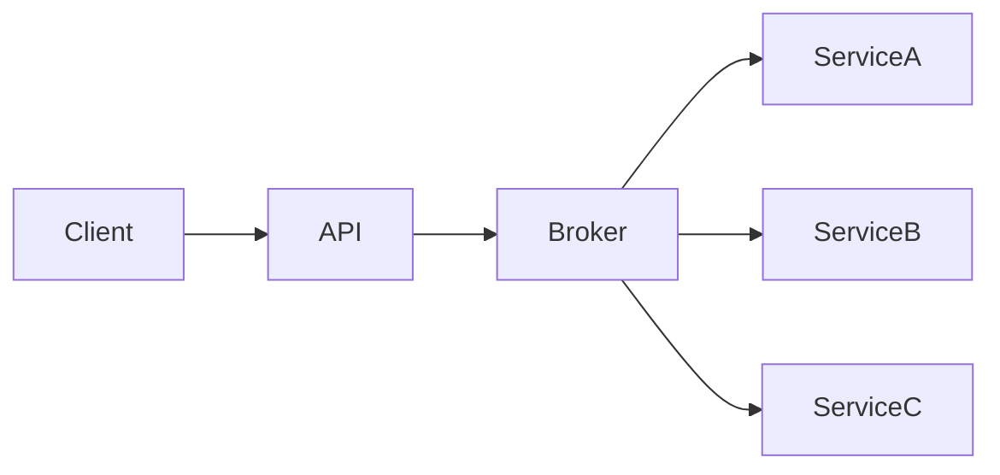
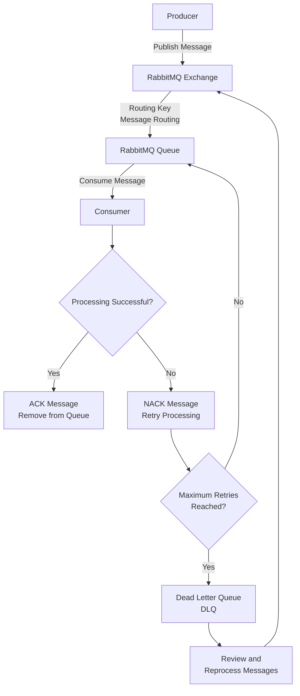
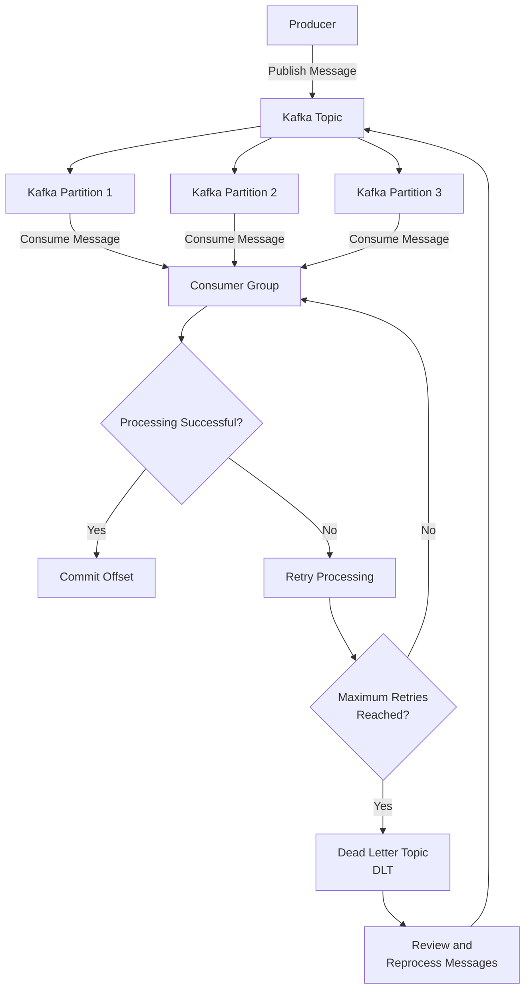
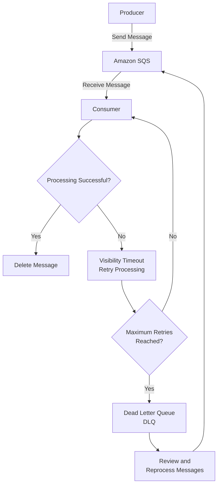
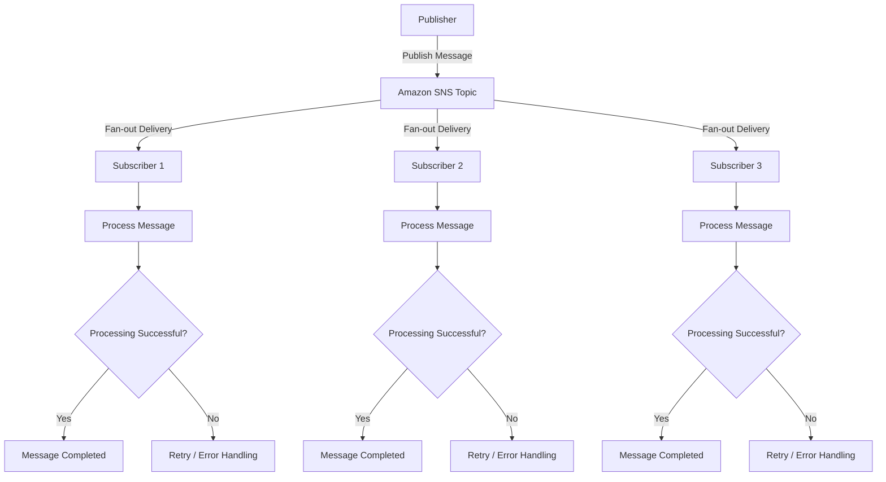
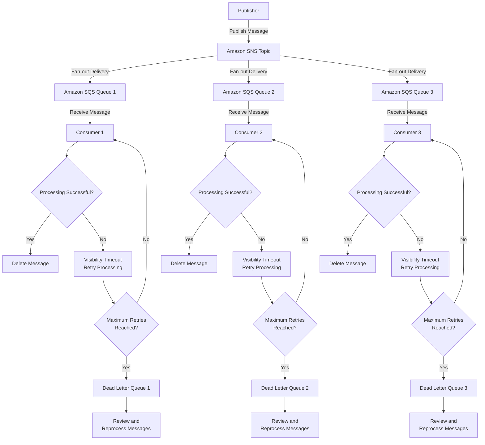

# Messaging

## Introduction

Messaging enables systems to exchange information asynchronously, reducing coupling while improving scalability, resilience, and fault tolerance.

## Synchronous vs. Asynchronous Communication

| Synchronous                | Asynchronous        |
| -------------------------- | ------------------- |
| Immediate response         | Deferred processing |
| Higher coupling            | Lower coupling      |
| More sensitive to failures | More resilient      |

## Fundamental Concepts

- **Producer:** Publishes messages or events.

- **Consumer:** Processes messages or events.

- **Message:** Unit of information sent by a producer.

- **Event:** Record of something that has occurred.

- **Queue:** Data structure where each message is consumed only once.

- **Topic:** Logical channel used to publish events to multiple consumers.

- **Exchange:** RabbitMQ component responsible for routing messages to queues.

- **Binding:** Association between an Exchange and a Queue.

- **Routing Key:** Key used by RabbitMQ to determine how messages are routed.

- **Broker:** Server responsible for receiving, storing, and distributing messages.

- **Partition:** Physical division of a Kafka topic that enables parallelism and scalability.

- **Offset:** Sequential position of an event within a Kafka partition.

- **Consumer Group:** AGroup of consumers that share the workload of consuming messages from a topic.

- **ACK / NACK:** Acknowledgment or negative acknowledgment indicating whether a message was successfully processed.

- **Retry:** New attempt to process a message after a failure.

- **Dead Letter Queue (DLQ):** Queue that stores messages that could not be processed successfully after the configured retry attempts.

- **FIFO (First In, First Out):** Processing model that guarantees messages are consumed in the same order they are produced.

- **Ordering:** Preservation of message processing order.

- **Visibility Timeout:** Period during which an Amazon SQS message remains invisible to other consumers after being received.

- **TTL (Time to Live):** Maximum amount of time a message can remain in a queue before it expires.

- **Event Replay:** Ability to reprocess previously persisted events.

- **Idempotency:** Ability to process the same message multiple times while producing the same result.

- **At Least Once:** Delivery guarantee where every message is delivered at least once, with the possibility of duplicates.

- **At Most Once:** Delivery guarantee where messages are delivered at most once, with the possibility of message loss.

- **Exactly Once:** Delivery guarantee where each message is processed exactly once.

- **Fan-out:** Distribution of a single event to multiple consumers.

- **Poison Message:** Message that repeatedly fails processing and cannot be successfully consumed.

## Messaging Patterns

- **Queue:** Messaging pattern where a message is stored in a queue and processed by one consumer, ensuring reliable and ordered message delivery.

- **Publish/Subscribe:** Pattern where a publisher sends messages to topics, and multiple subscribers receive copies of those messages independently.

- **Event Streaming:** Pattern where a continuous stream of events is produced, stored, and processed in real time or near real time.

- **Request/Reply:** Communication pattern where a requester sends a message and waits for a response from a service or consumer.

- **Competing Consumers:** Pattern where multiple consumers process messages from the same queue to improve scalability and distribute workload.

- **Saga:** Pattern for managing distributed transactions by coordinating a sequence of local transactions with compensating actions for failures.

- **Outbox Pattern:** Pattern that ensures reliable event publishing by storing a message in a database transaction before sending it to a messaging system.

## RabbitMQ

- **AMQP:** Messaging protocol that defines how applications communicate through message brokers like RabbitMQ.

- **Exchange:** Component in RabbitMQ that receives messages from publishers and routes them to queues based on rules.

- **Direct:** Exchange type that routes messages to queues using an exact routing key match.

- **Fanout:** Exchange type that broadcasts messages to all queues connected to the exchange.

- **Topic:** Exchange type that routes messages based on pattern matching between routing keys and bindings.

- **Headers:** Exchange type that routes messages based on message header attributes instead of routing keys.

- **Queue:** Storage component that holds messages until they are consumed by consumers.

- **ACK:** Message acknowledgment mechanism that confirms successful processing and allows RabbitMQ to remove the message from the queue.

- **Retry:** Mechanism to reprocess failed messages, usually with limits and delay strategies to avoid infinite processing loops.

- **DLQ:** Dead Letter Queue that stores messages that cannot be processed successfully or have expired.

- **Delay Queue:** Mechanism that postpones message delivery for a defined period before making messages available to consumers.

- **Priority:** Feature that allows messages to be processed according to their priority level instead of only their arrival order.

- **Cluster:** Group of RabbitMQ nodes working together to provide scalability, availability, and shared broker resources.

- **Federation:** Mechanism that connects RabbitMQ brokers across different environments or regions to exchange messages.

- **Shovel:** Feature that moves messages between RabbitMQ brokers, queues, or exchanges, often used for data migration or integration.

## Apache Kafka

- **Broker:** Kafka server that stores, manages, and serves messages to producers and consumers.

- **Cluster:** Group of Kafka brokers working together to provide scalability, fault tolerance, and high availability.

- **Topic:** Logical channel where messages are published and stored in Kafka.

- **Partition:** Subdivision of a topic that enables parallel processing, scalability, and message ordering within each partition.

- **Offset:** Unique sequential identifier assigned to each message within a partition, used by the consumer to track its position.

- **Consumer Group:** Group of consumers that collaboratively process messages from a topic, with each partition assigned to only one consumer in the group.

- **Replication:** Process of copying partitions across multiple brokers to provide fault tolerance and data availability.

- **Leader/Follower:** Partition replication model where the leader handles reads and writes while followers replicate data and can take over if the leader fails.

- **Replay:** Ability to reprocess previously stored messages by resetting consumer offsets and reading events again.

- **Kafka Connect:** Framework for integrating Kafka with external systems such as databases, storage platforms, and applications.

- **Kafka Streams:** Library for building real-time stream processing applications that consume, process, and produce Kafka events.

- **Schema Registry:** Service that manages and validates message schemas to ensure data compatibility between producers and consumers.

## Amazon SQS

- **Standard Queue:** Highly scalable queue type that provides at-least-once message delivery with best-effort ordering.

- **FIFO Queue:** Queue type that guarantees exactly-once processing and preserves the order of messages within message groups.

- **DLQ:** Dead Letter Queue that stores messages that cannot be successfully processed after multiple attempts.

- **Visibility Timeout:** Period during which a message is hidden from other consumers after being received, allowing time for processing.

- **Long Polling:** Message retrieval method that waits for messages to become available, reducing empty responses and API calls.

- **Delay Queue:** Feature that postpones message availability for a configured amount of time before it can be consumed.

- **Lambda Integration:** Feature that allows AWS Lambda functions to automatically consume and process messages from an SQS queue.

## Amazon SNS

- **Topic:** Logical communication channel where publishers send messages that are distributed to multiple subscribers.

- **Publisher:** Application, service, or system that sends messages to an SNS topic. The publisher does not need to know who the subscribers are; it only publishes messages to a topic.

- **Subscriber:** Application, service, or endpoint that receives messages published to an SNS topic.

- **Fan-out:** Messaging pattern where a single message is delivered to multiple subscribers simultaneously.

- **Message Filtering:** Feature that allows subscribers to receive only messages that match specific attributes or filtering rules.

- **SNS + SQS:** Integration pattern where SNS distributes messages to multiple SQS queues, enabling reliable and scalable asynchronous processing.

- **SNS + Lambda:** Integration pattern where SNS triggers Lambda functions to process messages automatically in response to published events.

## Amazon SNS + Amazon SQS

# Best Practices

- Implement idempotency.

- Configure DLQ.

- Use exponential retries.

- Version events.

- Monitor queues and consumers.

- Avoid large messages.

- Apply observability practices.

# Anti-Patterns

- Using infinite retries.

- Using RabbitMQ as a database.

- Using Kafka for simple job queues.

- Embedding business logic in events.

- Using a single topic for all events.

- Using stateful consumers.
